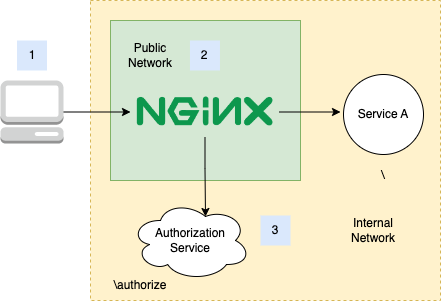

If you limit the access to your services/web pages with an external auth service, you can do that with Nginx `auth_request`.

This can be handy for the case that you cannot change the source code of the services that you owned so you cannot just directly modify the codes to add authentication logic or you just want to share the same authentication service with all the services/web pages routed from the Nginx service.

And the setup is quite simple, just need to define one location for the path to the authorize request, and then define the `auth_request` of the service at location `/` as `/authorize`

```
location / {
    auth_request /authorize;
    proxy_pass ${SERVICE_HOST}; # proxy to Service A
    proxy_ssl_server_name on;

    proxy_set_header Host $tableau_host;
}

location = /authorize {
    proxy_set_header X-Original-URI $request_uri;
    proxy_set_header X-Original-METHOD $request_method;
    proxy_pass_request_body off;
    proxy_set_header Content-Length "";

    proxy_pass ${AUTH_HOST}/authorize;
}
```



1. The client application access service A through Nginx.
2. Nginx routes the requests and authenticate the requests with the Authorization service
3. Authorization service can use the Cookies passed from the client or other data sent in the requests to authenticate the user