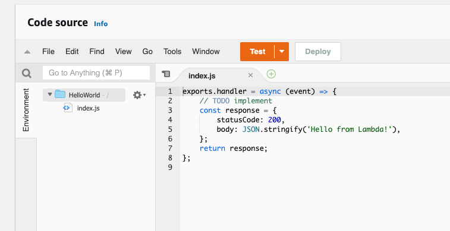
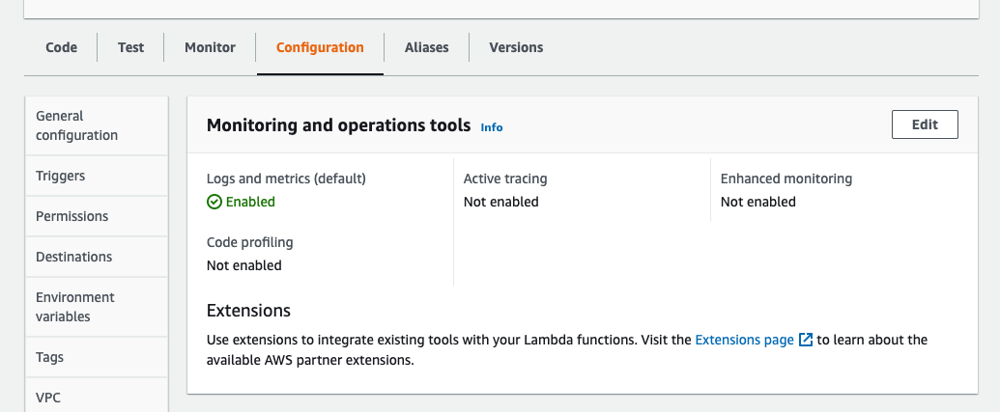
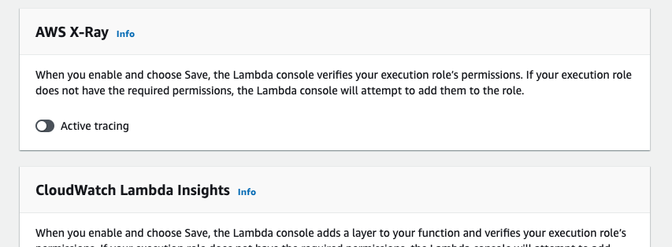
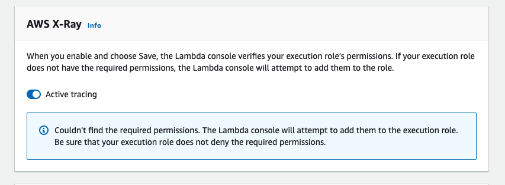
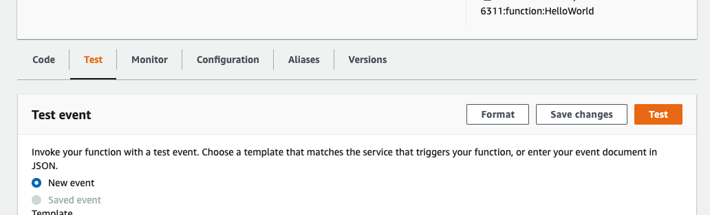
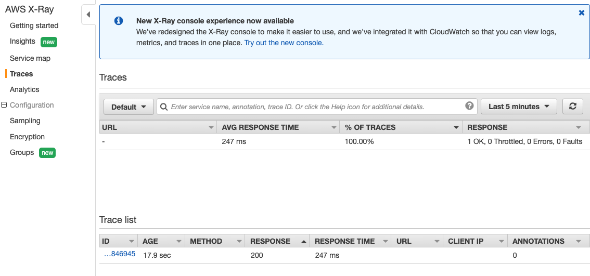
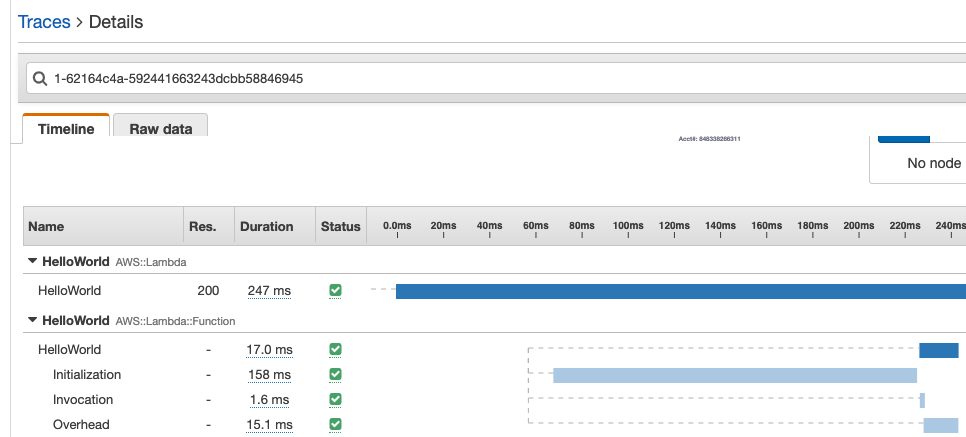
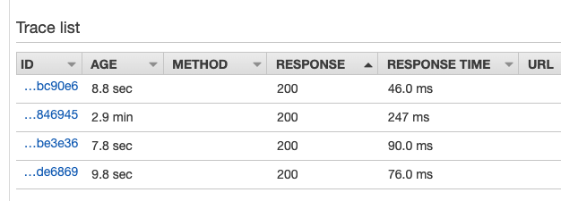
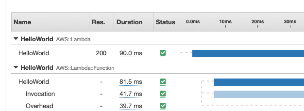
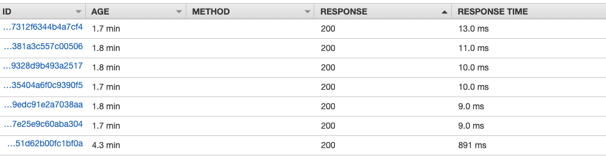

## Cold start!?
One of the down side of Lambda, or serverless function in general, is that every now and then, the environment that the Lambda function running on, need to be initialized before the serverless functions can actually be executed. And the initialziation phase of running a Lambda function is what we called, "Cold Start". "Cold start" is bad because it increase the response time of a Lambda function. But how bad is it really? How can we monitor the "cold start" of a Lambda function?

## Monitoring the cold Start of a Lambda function with X-Ray

We can use X-Ray to monitor the cold start of a Lambda function.

1. As an example, we have a simple Hello World Lambda function here in AWS console.

2. Go to configuration. You should see that active-tracing is not enabled.

3. Click edit

4. Enable Active tracing

5. Now test the Lambda function!

6. Now go to the X-Ray console right after triggering the execution of the Lambda function and we can see the trace of the Hello World request there. By default it shows the traces of last 5 minutes. Now click on the trace.

7. We can find the timeline of how the Lambda was executed. For this request, the initialization (Cold start) took 158ms while the actual invocation only took 1.6ms!

8. Now go back to Lambda console to execute the Hello World Lambda function a few more times. After that, we should be able to see a few more traces in X-Ray console and we can find out how those requests performed.

9. Clicking on one of the newer traces, we can see that there's no "initialization" phase in the request because the environment was re-used and there was no cold-start for that request.

## Another example

I created another Lambda function with Serverless Framework and did some tests. I put the source [here](https://github.com/singmak/aws-lambda-cold-start-test)

For a Lambda function written in Typescript and does a simple SQL query to a PostgresDB. It took around 800ms second to perform a cold start.

