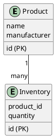
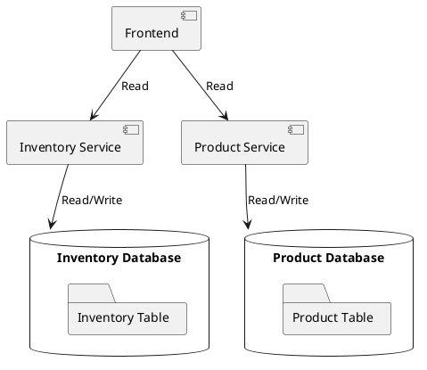
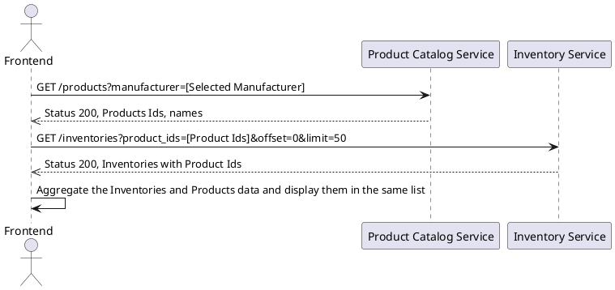
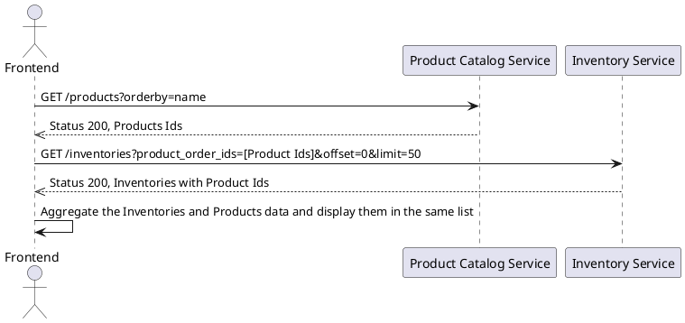
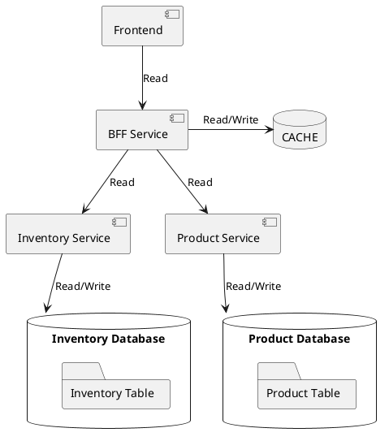

In a monolith system, dealing with related data is straightforward since they often reside in the same RDS database. Retrieving and combining this data is simple through joins, making it easy to filter or sort a list based on properties of the related data connected by foreign keys. Additionally, ensuring data consistency is relatively manageable, as all data constraints can be enforced within the same database.

However, the landscape changes significantly in a microservices system. In this architecture, related data may be distributed across different services, posing new challenges.

## An Example

Imagine a scenario in a microservices system where there are two services - one responsible for managing the product catalog, and the other for managing product inventory. Now, let's consider a simple requirement: displaying a list of inventory information for various products. In this list, we want to include:

Product names and manufacturers, which are stored in the product catalog service.
Inventory information for each product, which is available in the inventory service.
However, there's a challenge - the inventory database doesn't hold product details such as the product name or manufacturer. Instead, the inventory data is linked to the product information using unique product IDs.

Consequently, the frontend faces the task of querying information from both services and aggregating it on the user interface. It must retrieve product names and manufacturers from the product catalog service and combine them with the corresponding inventory data obtained from the inventory service to create the complete list. This data aggregation process can be complex and requires careful handling to ensure seamless user experience.

#### Entities

#### Components

### Filtering Inventory data with the products data

Filtering inventory data using product IDs is easy. But, if you want to filter based on other product details like names or manufacturers, it gets more complicated. You'll first need to get a list of product IDs and then send them to the Product Catalog Service to get the relevant information.

This means more steps and requests, which can slow down data retrieval. It might not be the best way, especially for a large number of products, to filter inventory data using different product properties owned by another service.

### Sorting Inventory data with the products data

Sorting the inventory data based on product names can be challenging because the inventory service lacks information about the order of products according to their names. To achieve this, the Product Catalog Service needs to provide the order information.

Here's the process: the frontend first retrieves the product ordering information from the Product Catalog Service and then passes it to the Inventory Service. However, if there are 1000 products in the database, the web client needs to send 1000 product IDs to the Inventory Service! As you can imagine, this approach is not very efficient, especially when dealing with a large number of products.

In such cases, sorting inventory data by product name using this method may not be practical or feasible. There's a need to find alternative solutions to enhance the sorting process and improve overall system performance.

## Challenges with this Approach

While the described approach of querying data from different backend services and aggregating it on the frontend can work, it comes with some significant challenges:

Excessive API Requests: The frontend needs to make multiple API requests to different backend services, leading to a high number of requests. This can cause poor performance in the frontend web client, leading to slower loading times and potential user frustration.

Complex Data Operations: Certain tasks, like sorting data with related information owned by another service, become complex and inefficient. The need to request and combine data from multiple services can result in a cumbersome process that hampers system performance.

Tight Frontend-Backend Coupling: The frontend becomes tightly coupled with various microservices. Any changes in the backend services require corresponding updates in the frontend as well. This coupling reduces flexibility and can lead to compatibility issues when different services evolve independently.

To overcome these challenges, adopting the Backend For the Frontend (BFF) pattern offers a more efficient and decoupled solution. The BFF service acts as a mediator, consolidating data from different backend services and providing a unified API tailored to the frontend's specific needs. This way, the frontend client interacts with a single BFF service, reducing API requests and simplifying data retrieval and presentation. The BFF pattern promotes better performance, scalability, and flexibility in microservices architectures.

# Simplifying Data Aggregation with the BFF (Backend For the Frontend) Pattern

The BFF (Backend For the Frontend) pattern offers an effective solution to address the data aggregation challenges discussed earlier. The core idea is to introduce a separate service dedicated to interacting with all other microservices. This intermediary service, known as the BFF service, efficiently aggregates data from different sources. Additionally, the BFF service can implement its own cache to further enhance data fetching performance.

Let's revisit the example mentioned earlier and see how it fits into the BFF pattern:

In this BFF architecture, the Frontend communicates exclusively with the BFF service. The BFF service then interacts with the Product Catalog Service and the Inventory Service to retrieve the necessary data. It aggregates this data and provides a unified interface to the Frontend, shielding it from the complexities of multiple backend services.

The BFF service can also implement caching mechanisms to optimize data retrieval. By reducing the number of redundant requests to backend services, it significantly improves frontend performance and overall system efficiency.

Adopting the BFF pattern ensures better decoupling between frontend and backend services, facilitating easier maintenance and updates. It offers a robust and scalable approach to handling data aggregation in microservices architectures, providing a seamless user experience.

### Advantages of the BFF Pattern

1. Performance Improvement
   1. Hosting Proximity: By situating the BFF service close to the API services, data retrieval becomes faster compared to fetching it from web browsers. This reduced latency translates to quicker response times, enhancing the overall frontend performance.
   2. Asynchronous Communication and Caching: The BFF service can communicate asynchronously with other API services using messages. It maintains its own cache of data and synchronizes it whenever changes occur in the data owned by other API services. This caching mechanism ensures that the BFF can swiftly respond to frontend requests with pre-fetched data, minimizing the need for repeated data retrieval.
2. Decoupling API Services and Frontend Client
   1. Simplified Maintenance: With the BFF pattern in place, any migrations or refactoring in the API services don't necessitate updates to the frontend code. The BFF service acts as an intermediary, shielding the frontend from backend intricacies. This separation allows for independent development and maintenance of both frontend and backend components.
   2. Compatibility Assurance: Changes in the API services could potentially cause compatibility issues with the frontend code if they are directly linked. However, since the frontend only interacts with the BFF service, any changes in the API services solely require updates and redeployment of the BFF service. This isolation ensures smoother upgrades and avoids disrupting the frontend functionality.
3. Tailored Data Aggregation: The BFF service can customize data aggregation specifically to suit the frontend's requirements. The BFF consolidates and transforms data, providing a unified and well-structured response. This tailored approach reduces unnecessary data fetches and simplifies data handling for the frontend.
