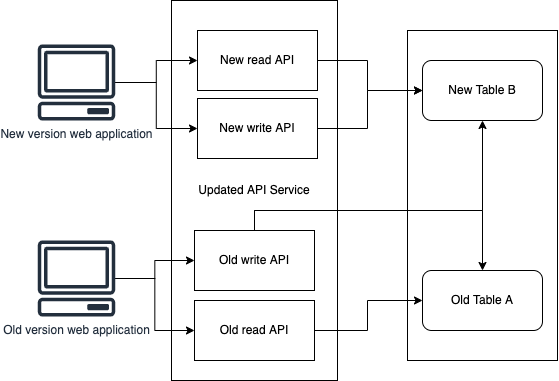

## Schema changes

To achieve no downtime, we should deploy database schema changes before deploying the new version of the API service. The reason is that if we deploy the new version of the API service first, the APIs that require the new database schema changes will be broken since the new database schema changes are not there yet.

Therefore, the new version of the database schema should be deployed first and it must be compatible with the existing version of the API in the production environment when the new API version is still not deployed, which means we cannot simply remove or rename any existing tables and columns or change the column data types. We can only do those changes (delete or alter tables, columns, etc) only when we are sure that the tables or the table columns are not referenced anywhere anymore in the API service.

## Data migration

Data migration may be required for different reasons such as infrastructure changes or business logic changes. To achieve no downtime during data migration, we need to handle it at the API codes level. 

For example, assume that there is an existing API service, which contains APIs that perform CRUD in a database table A. There is also a web application that makes requests to the API service.

We need to implement a new business flow and it will replace the existing flow. This new business flow requires the data to be structured differently so a new table B is created to meet the requirement of the new data model. A data migration script is written to transform the data in table A into the new structure and store the transformed data in the new Table B. Both the API service and the web application also need to be updated to implement the new business flow.

How to implement the API in the API services and perform the deployment in such a way that we can achieve no downtime?

First of all, even if we have deployed a new version of the web application, we cannot be sure that all client browsers will be loading the latest version of the web application since we cannot know when the users' browsers will load the latest version of the web application. So for a short amount of time, there will be some users who are still interacting with the old version of the web application. Therefore, in addition to adding new APIs for the new business flow, the existing API that is being used to write data to Table A also need to be updated to be able to transform the data and write to the new Table B. Doing it this way, we will only need to run the data migration script once to migrate the existing data.

After the new version of the API service is deployed, we can run the migration script to migrate the data from Table A to Table B with the new data structure. During this time, the web application is still not updated and it is still making requests to the old API. But since the old API has been updated to also transform and write data to Table B, we don't need to worry about missing some data in the new Table B.

After the data migration script finishes migrating the data, we can safely deploy the latest version of the web application, that is updated for the new business flow, and makes requests to the new API.

After running with the new updated version of the API service for some time and when all users are using the new version of the web application, the old APIs and the old Table A will eventually become obsolete and we can remove them in the next release of the API service.

