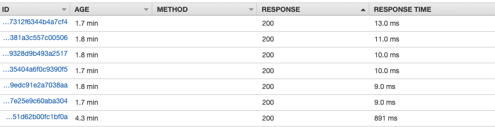

## "Cold start"?
One of the down side of Lambda, or serverless function in general, is that every now and then, the environment that the Lambda function running on, need to be re-initialized before the serverless functions can actually be executed. And the initialziation phase of running a Lambda function is what we called, "Cold Start". "Cold start" is bad because it increase the response time of a Lambda function. But how bad is it really? How can we monitor the "cold start" of a Lambda function?

## Monitoring the cold Start of a Lambda function with X-Ray

You can easily monitor the cold start of a Lambda function with X-Ray. I will use a very simple Hello World Lambda function as an example

Before a Lambda function can be executed, the service need to spend some time to prepare the environment and download the codes of the Lambda function. After the Lambda function is done executing, the environment can be kept running for some time so that the next Lambda execution can be executed without the need to spend the time to prepare the environment again. However, the prepared environment would be terminated after some time so the next execution of the Lambda would require the environment to be prepared again. The time spent on preparation of the environment and downloading the codes is called "cold start".

