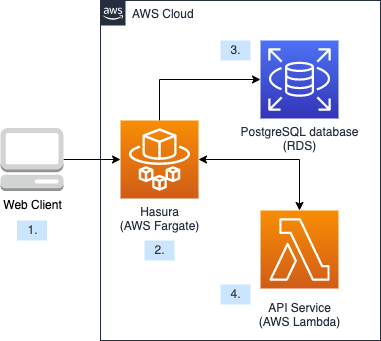

In the last few months, I got the opportunity to work with Hasura in a project at work. The project use Hasura as a GraphQL engine and the web application talks with
the Hasura server to communicate with the database, the architecture looks like this:



1. All the communication between the web clients and the database go through the Hasura service. The clients need to pass the query and the authorization token to Hasura.
2. The Hasura service acts as a middle man between the clients and the database.
3. Only the Hasura service is connected to the database
4. Hasura talks with a Lambda function to authenticate the user and also some other Lambda functions for performing actions that cannot be done with the generated GraphQL API.

Overall, I find it a really great tool, so I want to how it was like in my experience in this small post.

## What is Hasura, and what does it do for you?

In a few words, Hasura is a GraphQL Engine that can generate a GraphQL API based on your database's schema without you writing a single line of code. It also provides some extra features such as database schema migrations, data access management, custom actions and data change events handling. Currently, according to the [official doc](https://hasura.io/docs/latest/GraphQL/core/databases/index.html), these databases are supported by Hasura:
* Postgres
* MS SQL Server
* Citus / Hyperscale
* BigQuery
* MySQL (in preview) - See the preview guide

### The GraphQL Engine
The main feature of Hasura is that it can take your database and generate a production grade GraphQL API. It's great for people like me, who have never built a GraphQL API before. All I need to do is to launch a Hasura instance and connect it to a database 

You can do so much with the generated API: You can select any columns in a table; you can combine multiple conditions with "OR" and "AND"; you can do insert and update data; you can do sorting, pagination and join tables, data aggregation, etc. The generated GraphQL schema closely resembles the SQL language and the database schema so people who are familiar with SQL, can learn how to use the generated API very easily.

If you happened to use Typescript in your project, you can use [GraphQL Code Generator](https://www.GraphQL-code-generator.com/) to generate the types from the Hasura GraphQL engine endpoint so that you don't need to code the types of GraphQL query request/response models yourself.
### Extending the GraphQL API with "Hasura Action"
While the generated GraphQL API is very good for query data, you may not want the user to directly use the generated GraphQL to insert data into your database because it provides too much freedom in how the data can be input. You may want to add some extra logic to validate or transform the user inputs before they are inserted into the database. In these cases, you can create new Hasura Actions and configure them to pass the requests to APIs that we implement on our own while blocking the users to access generated insert API.
### Performance
During my usages, I didn't face any performance issues with Hasura, I found that the performance of the query highly depends on how the query is written. The GraphQL API provides so much freedom to the frontends, so they can query just exactly what they need and keep the response size small. On the other hand, a query that involves many tables joins with a large amount of data can be very slow and even cause request timeout in some cases.

### Database Migration
While you can just use an existing database with Hasura and manage the database schema migrations with other tools, you can also use Hasura to manage the database schema changes in migration files. For basic usage, you can just use the Hasura console UI to change the tables/columns schema and new migration files will be generated automatically. For database changes that you cannot do with the Hasura console UI, you can still write plain SQL statements and keep them in migration files. By using the Hasura database migration feature, you can revert your changes in the database and also apply the same schema changes in the databases of different environments.

### Hasura console, CLI and metadata files
To manage your Hasura service and your database, you need to learn how to use the Hasura console and the CLI. I find the console rather user-friendly, even before I read any documentation, I know how to use most of the features already. You can launch the Hasura console locally on your computer and connect it to a remote Hasura GraphQL engine. The Hasura console is the central place where you can learn about the generated GraphQL API schema and a playground for testing the GraphQL queries. You can do any query there and even customize the query Headers, I always use it to test the role permission changes on the data.

Any changes you make in the console are stored in the connected database and exported as metadata files as well. The metadata files can be used by apply the same Hasura configurations to different Hasura instance in different environments. Also, while the Hasura console is easy to use and good for configuring the Hasura server, it is not the most efficient way to configure Hasura, especially when you have a lot of tables that you want to configure at the same time. Sometimes, it's better to directly edit the metadata files to change the configuration of the different tables. You can even write a simple script to generate the metadata files. After all, the metadata files are just some JSON files. You can easily use any script language that can manipulate JSON to update or generate the Hasura metadata. In the project that I was working on, I have a small script that generate the permissions rules for all the tables in the database.

### Granular permission management
The requests to the Hasura server can be authorized by either putting an Admin secret or an Authorization token in the request headers. If a request contains an Admin secret in the request headers, the request will have full access to the data. If a request contains a JWT in the Authorization header, the request will have the permission based on the user and role information contained in the token.

Admin secret is mainly for administrating the Hasura server, can must not be shared with the client applications. The client application can pass an Authorization token in the request headers, and Hasura can validate and decode the token to get the role and user metadata. Every request can be assigned a single Hasura role in the token, and different roles have different access to the data. For example, you can define a "creator" role that can insert, update or select the rows in a table and a "viewer" row that is only allowed to get the data. You can even limit the roles to only be able to access some columns.

One very useful feature that I use, you can define permission rules so that the access of the rows can be based on the value stored in the columns and the user metadata. For example, there can be a "user_id" column in the table, and we can define a permission rule in a role so that a user with the role can only access the rows which contain the same "user_id" value with the user's ID.

So how does Hasura validate the user and decode the user's token to get the role and user's metadata? It can be done in 2 ways: JWT and webhook. The project that I worked on uses webhook to authorize the user. First, you need to set the webhook endpoint in the Hasura instance, after that, for every GraphQL request, Hasura will send the authorization token to the webhook API, the webhook API can validate and decode the token to know if the user is authorized to access the data and which Hasura role should be assigned to the user. The status response of the authorization webhook request must be 200 and the response body should contain "X-Hasura-Role" to assign the request to a role and other user metadata for filtering the data. As an example:
```
{
    "X-Hasura-User-Id": "25",
    "X-Hasura-Role": "user",
    "X-Hasura-Is-Owner": "true",
    "X-Hasura-Custom": "custom value"
}
```

### Data change events
You can easily configure to trigger a webhook API to be executed when there's a data change event happen on any tables. The subscription is done on the database level, so even if you directly change the data in the database table (without going through the Hasura GraphQL API), the event will still be triggered to call the webhook API. We need to be aware that the change events are not triggered in order.
### As a middle man between your AWS Lambda function and the database
Directly talking with the traditional SQL database in an AWS Lambda function can be tricky because of the following reasons:
1. It's very difficult to share DB connections between Lambda functions executions. Lambda functions are executed in containers so when the Lambda functions are executed in different containers, their DB connections cannot be shared. If a Lambda function happened to reuse an existing container to execute, the DB connection can be reused. However, we faced a problem in trying to reuse DB connections for different Lambda function executions. However, when our team tried to keep the connections around to be shared between Lambda executions, we faced random "Connection terminated unexpectedly" errors. After doing some googling, I found that many people faced the same issue too. It seems that the Lambda architecture is not very compatible with how PG works(the Postgres DB client library in Javascript). [There's a long discussion about it.](https://github.com/brianc/node-postgres/issues/2112). So in the end, we decided to not share DB connections between Lambda execution, so every execution of the Lambda that needs to connect to our Postgres DB need to create their DB connection and close the connection when the execution of the Lambda is done... There's a small performance cost for creating a new DB connection in every Lambda execution but it's the best workaround for now...

2. AWS Lambda functions can scale automatically but the database is not. If there are a lot of Lambda requests to the same database at the same time, the number of connections to the database may exceed the allowed limit and refuse new connections to the database. so far we didn't face this problem after we decided that we disconnected from the database when a request is done. However, if there are a large amount of concurrent Lambda executions, it could still exceed the maximum DB connections limit.

It seems that architecturally serverless functions do not work well with a traditional database so it's better to use a proxy or a middle service between the Lambda function and the database and Hasura can be used for this purpose. If a Lambda function calls Hasura to get the data from the database, there would be no need to deal with those connection problems anymore and there will be no overhead of connecting to the database in every request. We won't need to worry about exceeding the maximum number of database connections because Hasura keeps a constant amount of the connection to the database. Lambda functions can just query the data from Hasura via simple Graphql API HTTPS requests.
### Dependency on the database schema
The GraphQL API highly depends on the database schema, which may not be very good from the security point of view since people can know the columns and tables names in the DB simply by checking the payload of the GraphQL request.

## Verdict
While I don't have much experience on implementing GraphQL API on the backend, I can imagine it must be a lot of hard work to implement and maintain a GraphQL API to query our own database, and Hasura does this hard work for us. We can enjoy the benefit of GraphQL without spending the time and effort to implement a GraphQL API on our own. It also provides a lot of other features so that we can manage the data access for the users and extends the GraphQL API with Hasura Actions. The generated Hasura API, together with a little work on the authorization and maybe a few extra Hasura actions, is probably good enough for most project already. The time and effort that it can save for us, and the flexibility that it provides, make it a very good option for a lot of projects to use as a way to talk with the databases.

## Example
I have built a small example to show how to use Hasura.
https://github.com/singmak/hasura-example
## Official doc
https://hasura.io/docs/latest/graphql/core/index.html